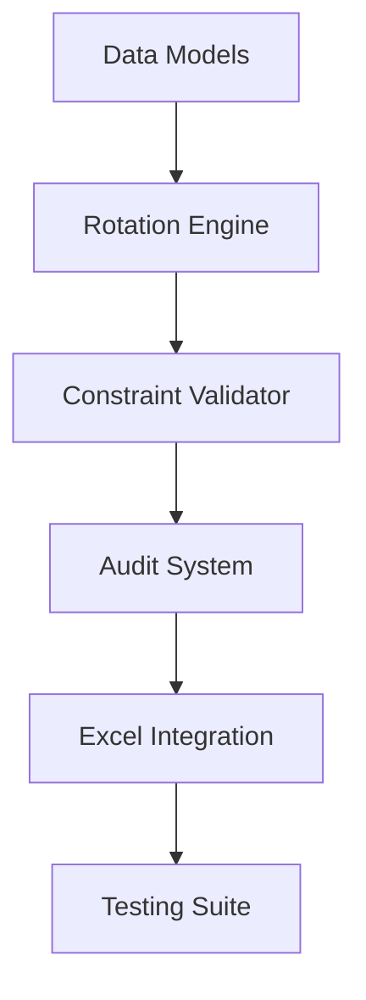

# Medical Rota System Implementation Plan

## Architecture Design (SOLID-compliant)
### Core System (src/core)
- **StaffManager**: Handles team/gender data
- **ShiftAllocator**: Implements rotation logic
- **EquityTracker**: Monitors shift distribution
- **AuditLogger**: Generates Excel trails

### Interfaces (src/interfaces)
- **IDataImporter**: AL input contract
- **IReportGenerator**: Excel output contract

### Services (src/services)
- **ManualInputService**: Implements IDataImporter
- **ExcelReportService**: Implements IReportGenerator

## Implementation Roadmap


## Key Technical Decisions
- Python 3.11+ with:
  - pandas for data handling
  - openpyxl for Excel reports
  - pytest for TDD
  - logging for audit trails
- Weekly rotation state persisted in JSON
- Validation layer with atomic checks:
  ```python
  class GenderValidator:
      def validate(shift: Shift, doctor: Doctor) -> bool:
          return shift.gender_requirement in [doctor.gender, 'Any']
  ```

## Compliance Measures
- 100% test coverage for allocation algorithms
- <250 line modules with type hints
- Daily schedule generator contract:
  ```python
  class IScheduleGenerator(ABC):
      @abstractmethod
      def generate_week(rotation_state: dict) -> Schedule:
          pass
  ```

## Risk Mitigation
- Fallback allocation strategy for constraint conflicts
- Detailed conflict resolution reports
- Versioned schedule outputs

## First Deliverables
1. Staff database loader
2. Base rotation pattern implementation
3. Essential shift allocator with gender validation
4. Basic Excel report template
