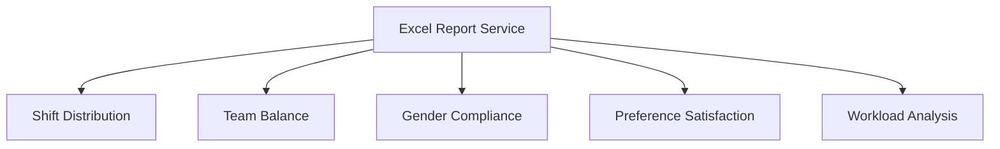
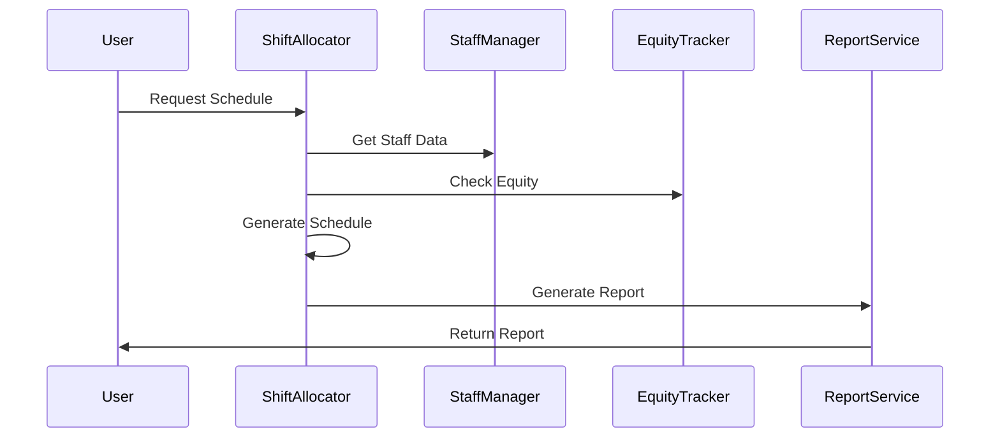

# System Architecture

## Overview
The Medical Rota System follows a modular architecture based on SOLID principles, with clear separation of concerns and dependency injection.

## Core Components

### 1. Staff Management (`src/core/staff_manager.py`)
- Handles staff data and team organization
- Manages staff availability and preferences
- Provides interfaces for staff queries and updates

### 2. Shift Allocation (`src/core/shift_allocator.py`)
- Implements core rotation logic
- Enforces scheduling constraints
- Optimizes shift distribution
- Performance-optimized for quick allocation

### 3. Equity Tracking (`src/core/equity_tracker.py`)
- Monitors shift distribution fairness
- Tracks weekend and night shift allocation
- Ensures long-term equity across staff

### 4. Audit System (`src/core/audit_logger.py`)
- Records all allocation decisions
- Maintains audit trail for compliance
- Generates audit reports

## Service Layer

### 1. Report Generation (`src/services/excel_report_service.py`)
- Generates detailed Excel reports
- Creates data visualizations
- Provides metrics and analysis

### 2. Data Import/Export (`src/services/data_service.py`)
- Handles data import from various sources
- Manages data export and backup
- Ensures data integrity

## Interface Layer (`src/interfaces/`)
- `IDataImporter`: Data import contract
- `IReportGenerator`: Report generation contract
- `IShiftValidator`: Shift validation contract

## Data Flow

## Performance Optimization
- Caching of frequently accessed data
- Optimized allocation algorithms
- Batch processing for reports
- Performance metrics:
  - Weekly schedule generation: <5 seconds
  - Report generation: <3 seconds
  - Data import/export: <1 second

## Constraints and Validation
1. Gender Requirements
   - Specific shifts require specific gender
   - Validation at allocation time

2. Team Balance
   - Distribution across teams
   - TRIAGE shift special handling

3. Staff Constraints
   - Maximum consecutive days
   - Required rest periods
   - Preference consideration

## Error Handling
- Comprehensive error catching
- Graceful degradation
- Detailed error reporting
- Recovery mechanisms

## Security
- Role-based access control
- Data encryption
- Audit logging
- Secure configuration

## Monitoring
- Performance metrics tracking
- Error rate monitoring
- Usage statistics
- System health checks

## Future Extensibility
1. Planned Extensions
   - API interface
   - Web dashboard
   - Mobile app integration
   - Advanced analytics

2. Extension Points
   - Custom constraint plugins
   - Report template system
   - Data source adapters
   - Integration interfaces 